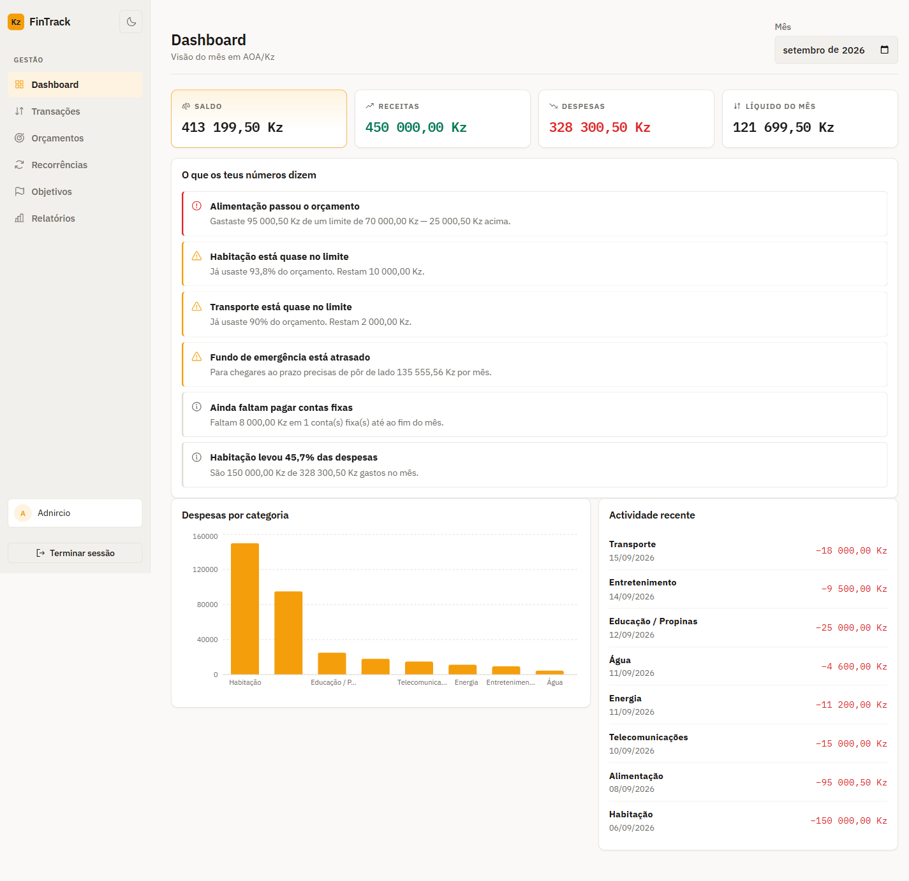
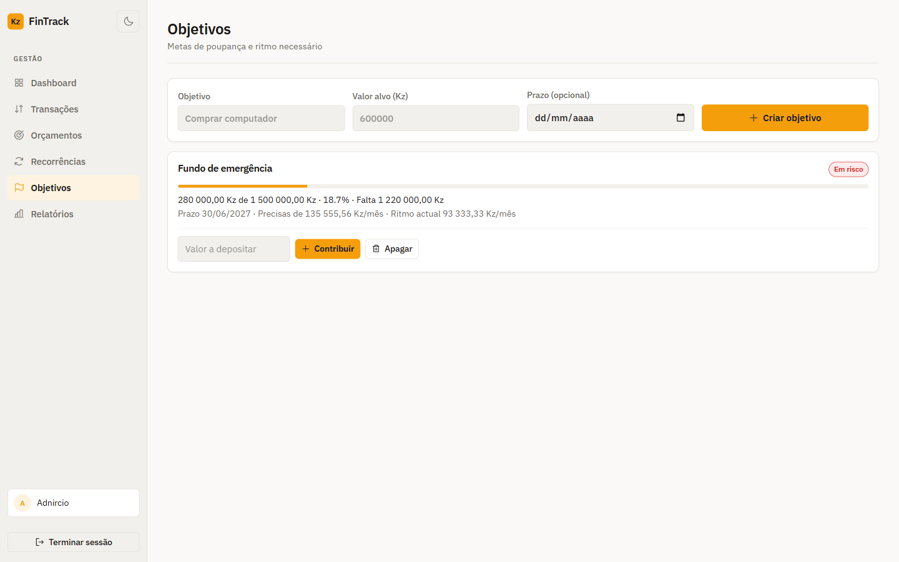
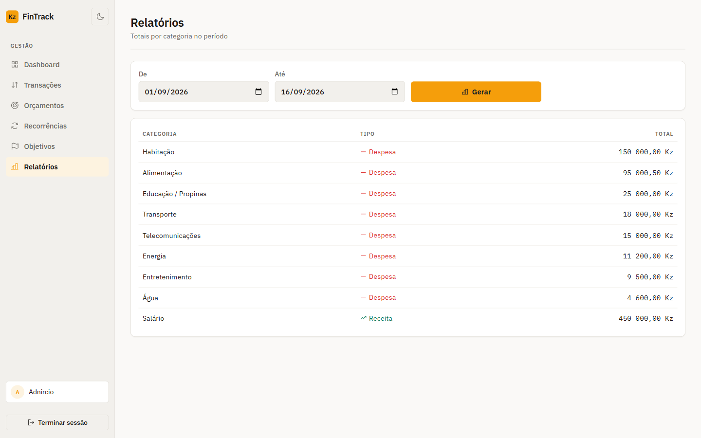

# FinTrack Angola

[](https://github.com/keny343/fintrack-angola/actions/workflows/ci.yml)

**Personal finance in Kwanza (AOA/Kz)** — portfolio Full Stack app.

React · TypeScript · Vite · Express · PostgreSQL · Docker · Vitest · GitHub Actions

**Live:** [fintrack-angola.vercel.app](https://fintrack-angola.vercel.app) ·
API health: [`/health`](https://fintrack-angola-api.onrender.com/health)

**Try it without signing up** — `adnircio@fintrack.ao` / `senha-forte-2026`. The account carries three
months of history, a broken food budget, an emergency fund behind pace, and two fixed bills, so every
screen has something in it. It is a shared demo, so expect other people's edits.

> Running on free plans: the API sleeps after 15 minutes idle, so the first request after a pause
> takes about a minute. Reload once and it answers.



<details>
<summary>More screens: savings goals, category report</summary>

Savings goals report the pace you would need against the pace you are keeping, which is what turns a
target into a decision:





</details>

## Problem

Managing salary, rent, transport, and day-to-day expenses in Angola often lives in spreadsheets or chat notes. That makes monthly budgets and category trends hard to see in **Kz**.

## Solution

FinTrack Angola is a role-of-one personal finance app that:

- Stores money as **integer centavos** (no floating-point drift)
- Uses **AOA formatting** and **dd/mm/yyyy** dates
- Ships Angola-relevant **system categories** (salário, propinas, energia, água…)
- Shows **dashboard KPIs**, **budgets vs spent**, and **category reports**

## Architecture

```text
React (Vite) ──credentials/cookies──▶ Express API ──▶ PostgreSQL
```

Details: [`docs/ARCHITECTURE.md`](./docs/ARCHITECTURE.md)

## Features (MVP)

| Area | What works |
|------|------------|
| Auth | Register, login, logout, httpOnly JWT cookie |
| Accounts | Default Numerário + Conta bancária |
| Categories | System seed + custom |
| Transactions | Income/expense create, filter, delete |
| Budgets | Monthly limit per category + progress |
| Dashboard | Balance, month income/expense, chart, recent activity |
| Landing | Public page with product preview, feature grid and security section |
| Reports | Totals by category for a date range |
| Goals | Savings targets with contributions, required monthly pace, on-track status |
| Recurring | Monthly rules (rent, salary, tuition) with idempotent catch-up on login |
| CSV | Export with the current filters; import with a per-line preview, all-or-nothing |
| Insights | The month read back in sentences, each computed from the user's own figures |

## Quick start

```bash
# 1) Env
cp .env.example .env

# 2) Database (Docker, or a native PostgreSQL on 5432 — see docs/DEPLOYMENT.md)
docker compose up -d

# 3) Backend
cd backend
npm install
npm run dev          # http://localhost:4000  (auto-migrates + seeds categories)

# 4) Frontend (other terminal)
cd frontend
npm install
npm run dev          # http://localhost:5173
```

Health: `GET http://localhost:4000/health`

## Tests

```bash
cd backend && npm test     # domain + API integration (PGlite, no Docker needed)
cd frontend && npm test
```

API tests boot **PGlite** (Postgres in WebAssembly) in-process, apply the real schema, and cover
auth, validation, budget math, and **per-user data isolation**. Details:
[`docs/TESTING.md`](./docs/TESTING.md).

## Security notes

Helmet, CORS allowlist, rate limits on auth/API, bcrypt passwords, parameterized SQL, httpOnly cookies.  
See [`docs/SECURITY.md`](./docs/SECURITY.md).

## The monthly summary

A language model may write the paragraph on the dashboard, but it never computes it. The figures come
from SQL and pure functions; the model is handed the finished numbers and allowed only to choose the
words. Every number in its answer is checked against the list of figures that were actually computed,
and an answer containing anything else is thrown away in favour of a summary the API composes itself.

With no API key the feature stays dormant and the app works exactly as before.
See [`docs/AI.md`](./docs/AI.md).

## Interface

Swiss-style minimal UI, gold on navy, with a light theme in warm neutrals.
Semantic colour tokens, IBM Plex Sans/Mono with tabular figures for money,
Phosphor icons, and motion gated by frequency and `prefers-reduced-motion`.
See [`docs/DESIGN.md`](./docs/DESIGN.md).

## Roadmap

- [x] Savings goals
- [x] Recurring transactions
- [x] CSV import/export
- [x] Deterministic monthly insights
- [x] Live deploy — Vercel (frontend) + Render (API and PostgreSQL)
- [x] Optional LLM narration on top of the insight facts, with the figures verified

## Author

**Adnírcio Inocêncio** — [keny343](https://github.com/keny343)

Licensed for portfolio demonstration. Do not commit secrets.
